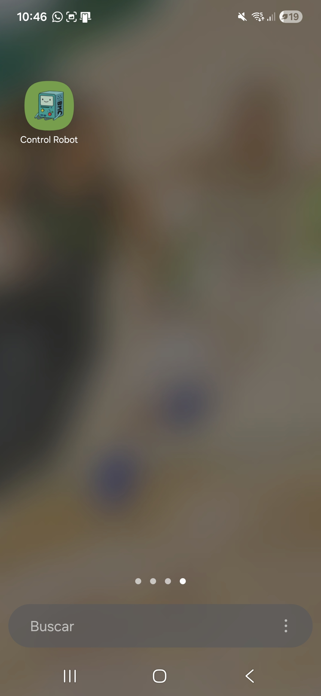
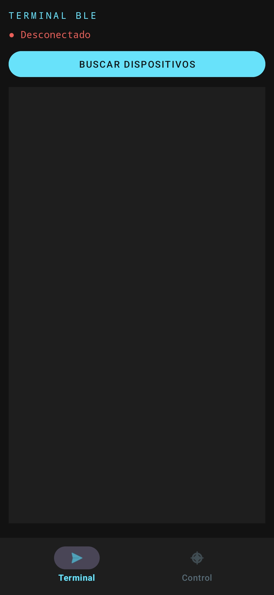
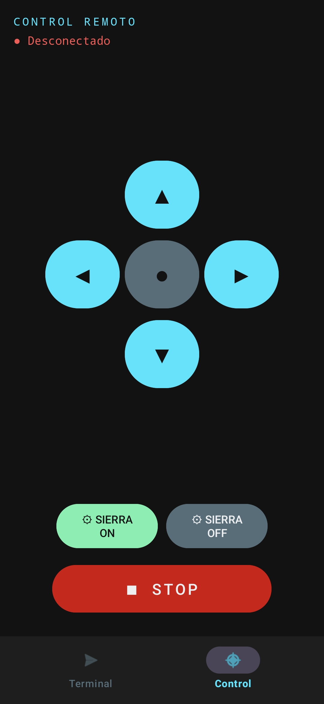

# **Robot**

# Descripción
Al principio iba a ser un robot vigilante para estar de guardia en la robobatalla. Pero despues se decidio que mejor iba a pelear. 

El software consta de dos partes:

La del **arduino** UNO que esta programada en Arduino IDE, se conecta por bluetooth al celular y funciona con una pequeña maquina de estados que controla los motores y el arma.

La parte del **celular**, esto fue lo mas tardado, encontrar la libreria correcta para conectar el bluetooth, trate de hacerlo para ios tambien pero me ondie y no encontre una libreria de flutter que fuera compatible con todo, asi que al final la hice en andriod studio. La app tiene la opcion de mandar mensajes en la terminal o usar un control con botones mas bonito.

